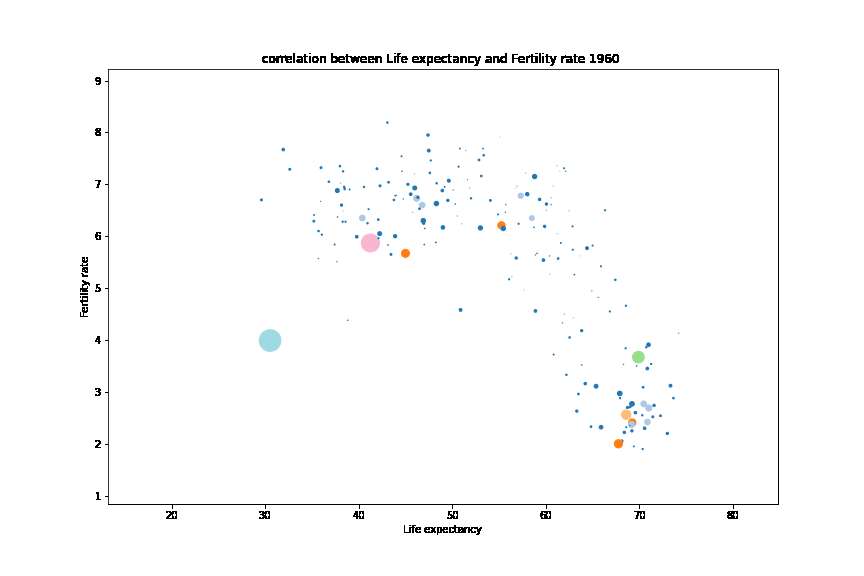

# Visual data analysis
This project was completed in week 1 of the Data Science Bootcamp at Spiced Academy.
The goal is to recreate [Hans Rosling's](https://youtu.be/fTznEIZRkLg) plots that depict the life expectancy and fertiliy rate of world's countries from 1960 to 2015, with points' sizes representing the population of the respective country. The data is publicly available on the [Gapminder project website](https://www.gapminder.org/data/).

Plotting of gapminder data using python plotting libraries: matplotlib, Plotly.
- read gapminder data using panda
- use dataframe functions to clean data
- use matplotlib to plot the data yearwise
- save all matplotlib plots in same directory

